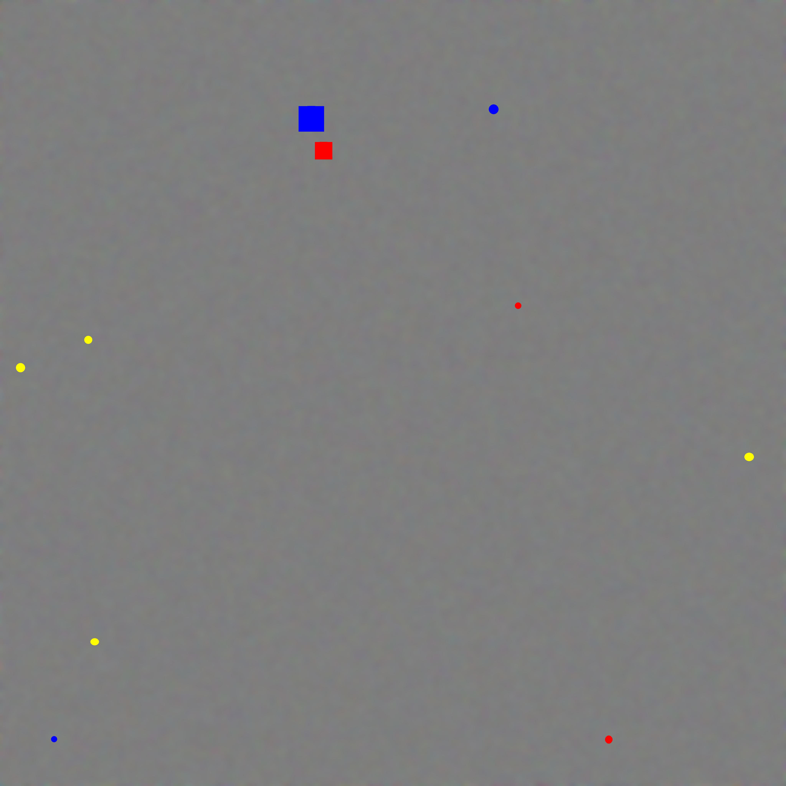
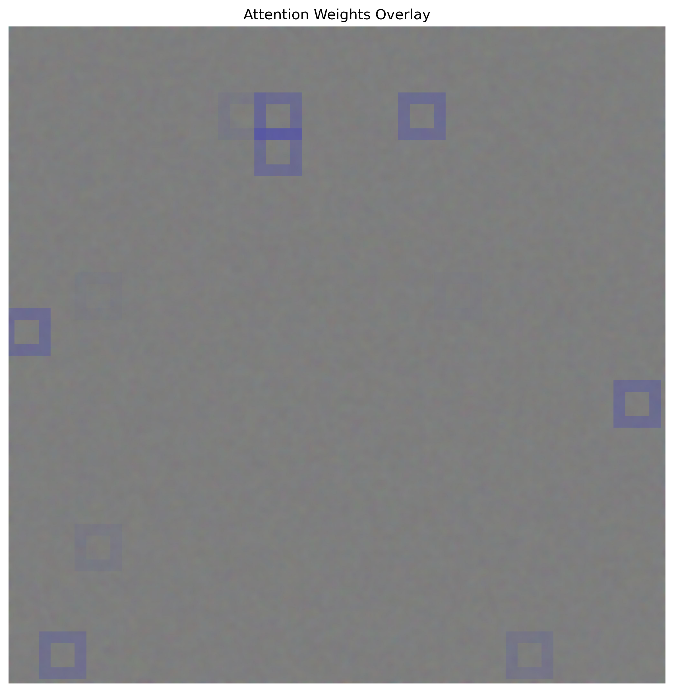

# High-Resolution Cell Imaging Analysis Using Multiple-Instance Learning

## Overview
This project implements a multiple-instance learning (MIL) pipeline for high-resolution cell imaging. Given that whole-slide images are typically megapixel or gigapixel in size, we extract fixed-size patches and process them with a custom MIL model. The model uses a customized ResNet for patch-level feature extraction, positional encoding to capture spatial information, and an attention aggregator to produce an image-level prediction.

## Method
### Data Preprocessing
- **Patch Extraction:** High-resolution images (e.g., 4096×4096) are divided into fixed-size patches (e.g., 224×224). The spatial coordinates of each patch are recorded (normalized to [0,1]) to preserve the original layout.
- **Synthetic Data Generation:** To test the pipeline, we developed a synthetic data generator that:
  - Produces backgrounds using random noise and Gaussian blur.
  - Randomly adds multiple markers (circles, ellipses, or rectangles) with varying sizes, orientations, colors, and thicknesses in positive samples.
  - If there exist at least one marker in the generated image, set label==1 else 0.
  - Logs image filenames and binary labels into a CSV file.
### Model Architecture
- **Patch-Level Feature Extraction (ResNetPatchCNN):** We use a custom ResNet composed of:
  - An initial 7×7 convolution with stride 2 and max pooling.
  - Three residual layers (each built with 2 basic residual blocks) resulting in 13 convolutional layers overall.
  - Global average pooling and a fully connected layer to generate a fixed-dimensional feature vector (e.g., 128 dimensions).
- **Positional Encoding:** Instead of concatenating raw spatial coordinates, a learned positional encoding (an MLP-based encoder) maps the 2D normalized coordinates into a higher-dimensional embedding (e.g., 32 dimensions). This richer spatial representation is concatenated with the patch features.
- **MIL Aggregation:** An attention module (implemented as a two-layer MLP with tanh activation) computes a softmax over the patch embeddings to produce attention weights. These weights are used to compute a weighted sum that serves as an image-level feature vector.
- **Image-Level Classification:** The aggregated feature vector is passed through a classifier (fully connected layers ending in a sigmoid activation) to predict the image-level label.
- **Mini-Batching Within an image:** To manage memory (given the potential for >100K patches per image), patches are processed in mini-batches during the forward pass before concatenation and aggregation.
## Training and Evaluation
- **Loss Function:** The model is trained end-to-end using binary cross-entropy loss with only image-level supervision.
- **Optimizer:** We used AdamW with lr=1e-3, betas=(0.9, 0.999), and weight_decay=0.05
- **Attention Visualization:** After training, attention weights are extracted and overlaid on the original image. A custom visualization function draws bold **blue boxes** over each patch, with opacity scaled by the corresponding attention weight. This helps verify whether the model focuses on regions containing markers.

 

## Getting Started
### Generate Synthetic Data
```
python generate_synthetic_data.py
```
### Model Training
```
python main.py --image_dir synthetic_images --label_file synthetic_images/labels.csv --patch_size 224 --image_batch_size 64  --num_epochs 10 --lr 1e-3 --checkpoint_dir ./checkpoints
```
### Visualize Attention Weights
```
python visualize_attention.py
```